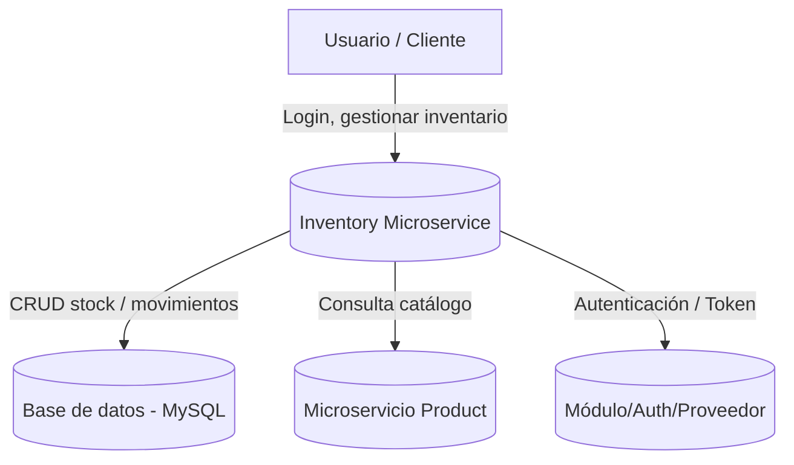
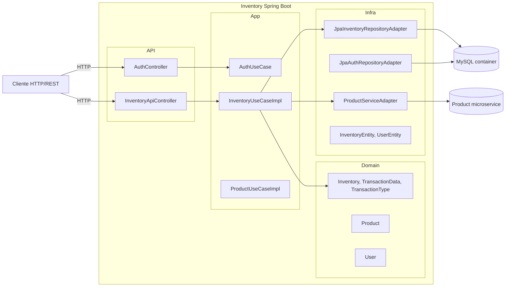
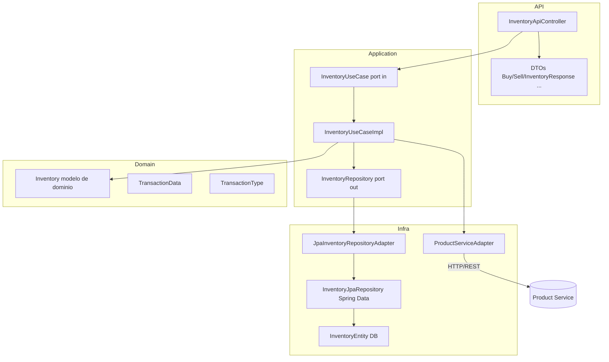

# Resumen de la Arquitectura — microservicio `inventory`

Este documento resume la **arquitectura de la aplicación** del microservicio `inventory` (repositorio: `inventory/src/main/java/com/example/inventory`) y explica cómo se aplican los principios de **Arquitectura de Puertos y Adaptadores (Hexagonal)**, **Screaming Architecture** y **Vertical Slicing**. Incluye diagramas C4 en Mermaid (C1, C2, C3) que soportan las ideas presentadas.

---

# Principios aplicados

- **Puertos y Adaptadores (Hexagonal)**  
  - Puertos de entrada: interfaces que describen los casos de uso (ej. `InventoryUseCase`, `AuthCommand`).  
  - Puertos de salida: interfaces que describen dependencias externas (ej. `InventoryRepository`, `ProductRepository`, `AuthRepository`).  
  - Adaptadores: implementaciones concretas (JPA adapters, `ProductServiceAdapter`, `JpaInventoryRepositoryAdapter`, `JpaAuthRepositoryAdapter`, controladores REST).

- **Screaming Architecture**  
  - La estructura de paquetes está orientada al dominio (`auth`, `management_inventory`, `management_product`, `api/v1`), de modo que al abrir el código “grita” su propósito de negocio.

- **Vertical Slicing**  
  - Cada feature / dominio (ej. inventario, producto, auth) contiene su API, casos de uso, dominio y adaptadores, lo que facilita desarrollar y desplegar funcionalidades completas y aisladas.

---

# Capas principales (por slice)

**API (Interfaces de entrada)**  
- `api/v1/controllers` y `api/v1/dto` — `AuthController`, `InventoryApiController` y DTOs para solicitudes y respuestas.

**Application (Casos de uso)**  
- `application/ports/in` (puertos de entrada) y `application/ports/out` (puertos de salida).  
- Implementaciones de casos de uso en `usecases/` (ej. `InventoryUseCaseImpl`, `ProductUseCaseImpl`, `AuthUseCase`).

**Domain (Modelo de negocio puro)**  
- Entidades y modelos en `domain/models` (ej. `Inventory`, `Product`, `TransactionData`, `User`).  
- Repositorios como interfaces en `domain/repositories`.

**Infrastructure (Adaptadores concretos)**  
- Adaptadores JPA y mappers en `infrastructure/adapters/repositories` (ej. `InventoryJpaRepository`, `JpaInventoryRepositoryAdapter`, `InventoryPersistenceMapper`).  
- Adaptadores de servicios externos en `infrastructure/adapters/services` (ej. `ProductServiceAdapter`).  
- Configuración común y seguridad en `shared/config` y `shared/security`.

---

# Estructura del proyecto (extracto relevante)

(Estructura provista por `tree` — extracto simplificado)

```
inventory/src/main/java/com/example/inventory
├── api/v1/controllers
│   ├── AuthController.java
│   └── InventoryApiController.java
├── auth
│   ├── application/ports
│   │   └── AuthCommand.java
│   └── infrastructure/adapters/repositories
│       ├── AuthJpaRepository.java
│       └── JpaAuthRepositoryAdapter.java
├── management_inventory
│   ├── application/ports/in/InventoryUseCase.java
│   ├── application/ports/out/InventoryRepository.java
│   ├── application/usecases/InventoryUseCaseImpl.java
│   └── infrastructure/adapters/repositories/JpaInventoryRepositoryAdapter.java
├── management_product
│   └── infrastructure/adapters/ProductServiceAdapter.java
└── shared
    ├── config/OpenApiConfig.java
    └── security/SecurityConfig.java
```

---

# Flujo de llamadas (ejemplo típico)

1. **Petición HTTP** → `InventoryApiController` (adaptador de entrada).  
2. Controller valida/mapea DTO → invoca **puerto de entrada** (`InventoryUseCase`).  
3. **Caso de uso** (implementación en `application/usecases`) ejecuta la lógica del dominio.  
4. Caso de uso usa **puertos de salida** (`InventoryRepository`, `ProductServiceRepository`) para persistir o consultar servicios externos.  
5. **Adaptadores de infraestructura** (JPA adapter, ProductServiceAdapter) implementan esos puertos y realizan la I/O.  
6. Resultado → mapeo a DTO → respuesta HTTP al cliente.

---

# Diagramas C4 (Mermaid)

> Pega cada bloque `mermaid` en GitHub/GitLab/VS Code que soporte Mermaid para visualizar los diagramas.

## C1 — Contexto del sistema


---

## C2 — Contenedores (dentro del microservicio `inventory`)


---

## C3 — Componentes (slice `management_inventory`)


---

# Cómo los diagramas respaldan los principios

- **Hexagonal:** C2/C3 separan claramente el núcleo (Application + Domain) de adaptadores (Infra). Los puertos aparecen como límites contractuales.  
- **Screaming Architecture:** Los nombres y organización (ej. `management_inventory`) hacen evidente el dominio y la responsabilidad al abrir el código.  
- **Vertical Slicing:** Cada feature “vive” completa en su slice: API, Application, Domain y Adaptadores. Los diagramas C3 muestran estas rebanadas verticales.

---

# Beneficios observados

- Alto grado de **testabilidad** (casos de uso y dominio aislados).  
- **Bajo acoplamiento**: cambiar la persistencia o la forma de exponer la API afecta solo adaptadores.  
- **Evolución guiada por negocio**: nuevas funcionalidades se agregan como nuevas vertical slices con mínimo impacto cruzado.  
- **Documentación automática**: presencia de `OpenApiConfig` y DTOs facilita la exposición de Swagger/OpenAPI.

---

# Recomendaciones prácticas

1. **Mantener dominio puro**: evitar anotaciones de frameworks en paquetes `domain/*`.  
2. **Nombrado por feature**: conservar `management_inventory`, `management_product`, `auth` — seguir el patrón feature-first.  
3. **Interfaces claras**: documentar puertos (JavaDocs) para que los adaptadores implementen contratos precisos.  
4. **Mapeo en adaptadores**: mapear DTO ↔ dominio en los adaptadores de entrada/salida, no dentro del dominio.  
5. **Pruebas por niveles**:  
   - Unit: dominio y use cases con mocks/stubs.  
   - Integration: adaptadores + DB (Testcontainers).  
   - E2E: `docker compose` para validación completa.  
6. **Considerar contratos** entre microservicios (Product ↔ Inventory): versionado de API o consumer-driven contracts.

---

# Conclusiones

- El microservicio `inventory` **implementa correctamente** los principios de Hexagonal, Screaming Architecture y Vertical Slicing; la estructura de paquetes y nombres lo evidencia.  
- La separación entre puertos y adaptadores y la organización por features facilita mantenimiento, pruebas y extensibilidad.  
- Para maximizar los beneficios, recomienda reforzar prácticas de pruebas de integración, documentar los contratos de puertos y mantener el dominio libre de dependencias de infraestructura.

---
